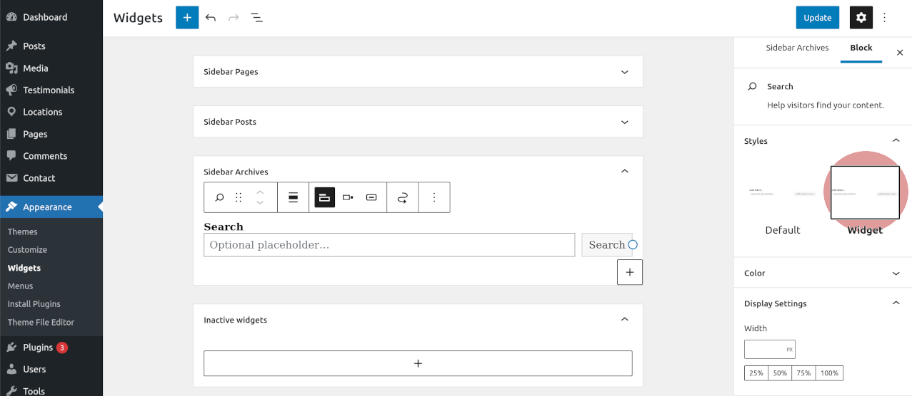

# Gutenberg Widget Styles

Add CSS classes to WordPress's Gutenberg widget blocks.

## Block Classes

| Block        | CSS Class                 | Root Element           |
|--------------|---------------------------|------------------------|
| Buttons      | is-style-widget-buttons   | div                    |
| Code         | is-style-widget-code      | pre                    |
| Gallery      | is-style-widget-gallery   | figure                 |
| Heading      | is-style-widget-heading   | h1, h2, h3, h4, h5, h6 |
| Image        | is-style-widget-image     | figure                 |
| Latest Posts | is-style-widget-posts     | p                      |
| List         | is-style-widget-list      | ul                     |
| Paragraph    | is-style-widget-paragraph | p                      |
| Quote        | is-style-widget-quote     | blockquote             |
| Search       | is-style-widget-search    | form                   |
| Table        | is-style-widget-table     | figure                 |

## Installation Guide

### Step one, copy over the script and styles

Copy the `src/gutenberg-widget-scripts.js` and `src/gutenberg-widget-styles.css`
files to some location inside your theme. The CSS file only contains empty
selectors, so you will need to define your own widget styles inside it.

### Step two, enqueue the above scripts and styles

Register the above scripts and styles using below action inside your
`functions.php` file. Remember to replace the `prefix` and insure the paths are
correct.

```php
/**
 * Add custom Gutenberg modifications.
 *
 * TODO: You should replace the below prefix.
 */
function prefix_gutenberg_widgets_enqueue() {
	$theme_version = wp_get_theme()->get( 'Version' );

	wp_enqueue_script(
		'prefix-gutenberg-widgets-script',
		get_stylesheet_directory_uri() . '/src/gutenberg-widget-scripts.js',
		array( 'wp-blocks', 'wp-hooks' ),
		$theme_version,
		true
	);

	wp_enqueue_style(
		'prefix-gutenberg-widgets-styles',
		get_stylesheet_directory_uri() . '/src/gutenberg-widget-styles.css',
		array(),
		$theme_version
	);
}
add_action( 'enqueue_block_editor_assets', 'prefix_gutenberg_widgets_enqueue' );

```

### Step three, just select the widget styling option

Basically just go to the widgets section and select the style named
"widget". See the below screenshot example.

<p align="center"></p>
